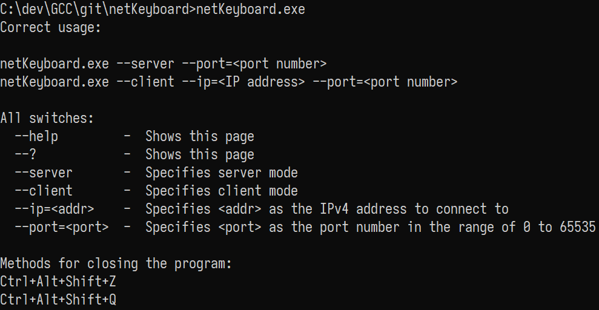

# netKeyboard

> A keyboard that works over the home network.

Inspired by [netKeyboard](https://github.com/makuke1234/UDPterminal) and written in C, netKeyboard is designed to provide
seamless experience when using the same keyboard to control multiple computers. Just start one instance as a keyboard server and you
can connect to it via another computer across the home network. Currently only M$ Windows support is planned.

## Obtaining

Currently, no releases yet due to active development.

# Usage

# License

This project is using the MIT License.
